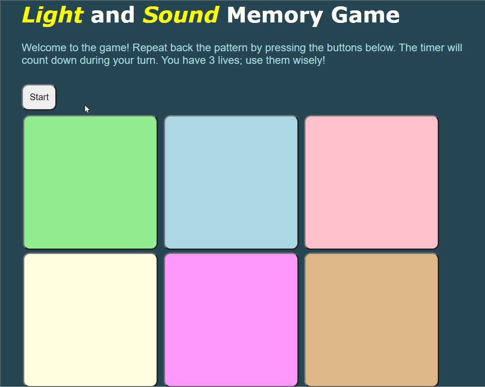

# Pre-work - _Memory Game_

**Memory Game** is a Light & Sound Memory game to apply for CodePath's SITE Program.

Submitted by: **Cristina Hilario**

Time spent: **8** hours spent in total

Link to project: [https://glitch.com/edit/#!/sound-and-light-memory-game](https://glitch.com/edit/#!/sound-and-light-memory-game)

## Required Functionality

The following **required** functionality is complete:

- [x] Game interface has a heading (h1 tag), a line of body text (p tag), and four buttons that match the demo app
- [x] "Start" button toggles between "Start" and "Stop" when clicked.
- [x] Game buttons each light up and play a sound when clicked.
- [x] Computer plays back sequence of clues including sound and visual cue for each button
- [x] Play progresses to the next turn (the user gets the next step in the pattern) after a correct guess.
- [x] User wins the game after guessing a complete pattern
- [x] User loses the game after an incorrect guess

The following **optional** features are implemented:

- [x] Any HTML page elements (including game buttons) has been styled differently than in the tutorial
- [x] Buttons use a pitch (frequency) other than the ones in the tutorial
- [x] More than 4 functional game buttons
- [x] Playback speeds up on each turn
- [x] Computer picks a different pattern each time the game is played
- [x] Player only loses after 3 mistakes (instead of on the first mistake)
- [x] Game button appearance change goes beyond color (e.g. add an image)
- [ ] Game button sound is more complex than a single tone (e.g. an audio file, a chord, a sequence of multiple tones)
- [x] User has a limited amount of time to enter their guess on each turn

The following **additional** features are implemented:

- [x] Disabled game buttons during clue playback to prevent overlap of the playback and the player's guess
- [x] A message, "playing clue", pops up during clue playback
- [x] Three different sound effects play when player wins, loses and makes a mistake
- [x] Player's lives are displayed as hearts, which are hidden when the player makes a mistake
- [x] Clue playback replays after the user makes a mistake

## Video Walkthrough

Here's a walkthrough of implemented user stories:

 

Round where timer runs out:

 

GIF created with [LiceCap](http://www.cockos.com/licecap/).

## Reflection Questions

1. If you used any outside resources to help complete your submission (websites, books, people, etc) list them here.

- [Google developers site](https://developers.google.com/web/updates/2017/09/autoplay-policy-changes#webaudio) to enable sound on the live site
- [w3schools](https://www.w3schools.com/) JavaScript (Math.random, parseInt, innerHTML, etc.); CSS (background-image, hexadecimal color values, etc.)
- [support.glitch.com](https://support.glitch.com/t/images-not-loading/15325) how to use assets on Glitch
- [freesoundeffect.net](http://freesoundeffect.net/) free audio for sound effects
- [clker.com](https://www.clker.com/) free clip art

2. What was a challenge you encountered in creating this submission (be specific)? How did you overcome it? (recommended 200 - 400 words)
  
    One challenge was faced when adding images to the game buttons.
  Initially, using images from the assets folder was difficult since it does not function like a normal directory.
  Visiting the glitch support page showed that clicking on the asset in the folder revealed a link that is meant to be used rather than a directory path.
  To add background images, I had added image elements within the button elements.
  In doing so, the buttons shifted downward and created awkward spacing.
  To fix this, I found that adjusting the image size to about 175 decreased the displacement of the buttons.
  Next, I had trouble syncing the reveal of the images with the user’s input.
  I had intended to toggle the images between the hidden class, but instead decided to implement the images similar to how the background color changes were applied to the buttons.
  I assumed that because they are both visual functions which sometimes depend on the player’s actions, that they could be implemented using similar approaches.
  I added two sets of CSS rules for each button where one affects the button if it is active and in the “right” class, and the other is applied to the button if it is active and in the “wrong” class.
  The “right” class added a green checkmark as the active button’s background image while the “wrong” class added a red X as the background image.
  When a user chooses the correct answer, the button should show the green checkmark, and when they choose incorrectly, the button should show the red X.
  To place the button in the correct class, “right” or “wrong”, I initialized the buttons after each playback so that the first button in the pattern is in the “right” class while the others are in the “wrong” class.
  This would cause the button to display a green checkmark if the player chose the first button in the pattern, and a red X if they chose any other button.
  After the player’s guess and if they still have more of the pattern to guess for that turn, the buttons are again assigned to the appropriate class depending on which button is next in the pattern.

3. What questions about web development do you have after completing your submission? (recommended 100 - 300 words)
   
   After working on this submission, I was even more interested in web development and how I could improve upon this project. 
   What are some ways I could make the game more visually appealing? How can I create a more interactive or responsive web page? 
   For example, I would like to have the buttons form rows of equal lengths even when the window is resized. How can I go about formatting a webpage? 
   For instance, how would I have the timer right-justified on the same line as the start button? Are there simpler or cleaner ways to implement the functions of this project? 
   For the functionalities I implemented myself and that I wish to implement in the future, I would like to learn more about good practices that developers use in professional environments. 
   In what way can I make my code more readable and efficient? What can using frameworks and libraries do to further elevate a website?

4. If you had a few more hours to work on this project, what would you spend them doing (for example: refactoring certain functions, adding additional features, etc). Be specific. (recommended 100 - 300 words)
   
   If I had more time to work on this project, I would try to clean up the code and research simpler ways to implement certain functions. 
   For example, it was necessary for my code to remove an element from the ‘hidden’ class and add it to the ‘inline’ class every time it is revealed, and vice versa when it is hidden. 
   I would try to avoid this repetition of code by perhaps using primarily classes instead of identifiers so that it is easier to introduce new CSS rules. 
   I would also like to add rounds where the amount of buttons increases after each round. 
   When a certain amount of buttons are reached, they would decrease in size so that they can adequately fit on the screen. 
   The amount of successive wins would be counted and displayed, and when the player loses a round the game resets to the beginning state.
   In order to accomplish this, I would need to add new functions to the script.js file to reveal the next button when the player advances to the next level. 
   This could involve removing the button from the hidden class. 
   There would also be a function to reset the game to the original state, where extra buttons are again placed in the hidden class. 
   To adjust the buttons’ width, height and margin, the css rules could be altered to use classes instead of identifiers in order to allow changes in properties. 
   I could also try [this](https://stackoverflow.com/questions/13528512/modify-a-css-rule-object-with-javascript) or [this](https://stackoverflow.com/questions/1409225/changing-a-css-rule-set-from-javascript) source to see if I can change the css rules from the script.js file.

## License

    Copyright Cristina Hilario

    Licensed under the Apache License, Version 2.0 (the "License");
    you may not use this file except in compliance with the License.
    You may obtain a copy of the License at

        http://www.apache.org/licenses/LICENSE-2.0

    Unless required by applicable law or agreed to in writing, software
    distributed under the License is distributed on an "AS IS" BASIS,
    WITHOUT WARRANTIES OR CONDITIONS OF ANY KIND, either express or implied.
    See the License for the specific language governing permissions and
    limitations under the License.
